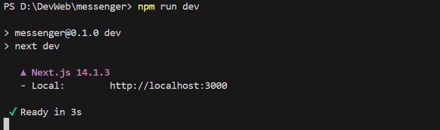
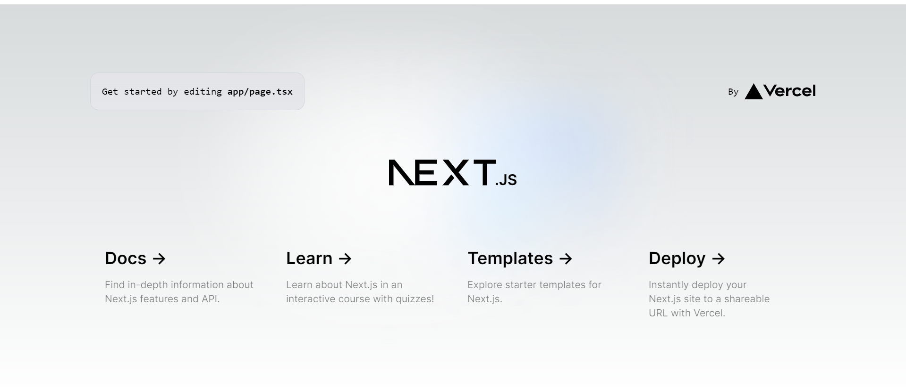

1.创建项目 

```shell
npx create-next-app@latest  --typescript --tailwind
```
使用指令后
```s
√ What is your project named?    messenger (替换成你自己取你的文件名)
√ Would you like to use ESLint?     No / Yes (Yes)
√ Would you like to use `src/` directory?     No / Yes (No)
√ Would you like to use App Router? (recommended)     No / Yes (Yes)
√ Would you like to customize the default import alias (@/*)?     No / Yes (Yes)
√ What import alias would you like configured?     @/*   (回车键)
```

2. 进入项目
```shell
cd messenger (你自己取你的文件名)
```

3. 启动项目
```shell
npm run dev
```
运行截图

浏览器网址 http://localhost:3000 运行效果如下图


4. 